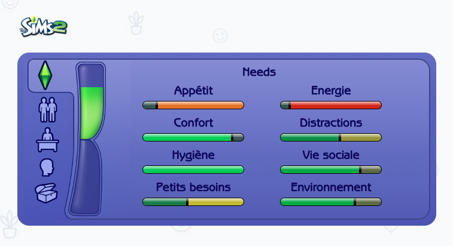

# Pixel Mood


A web application inspired by The Sims franchise that recreates the iconic mood tracking system across all four generations of the game. Experience the nostalgic visual styles and user interfaces from The Sims 1, 2, 3, and 4 while managing your Sim's needs and moods.
You can check the online version at [pixelmood.fr](https://pixelmood.fr/).

<div align="center" style="margin: 40px 0;">

</div>

## Features

- **Multi-Generation Support**: Switch between The Sims 1, 2, 3, and 4 visual styles
- **Interactive Mood System**: Adjust 8 different needs (Hunger, Energy, Comfort, Fun, Hygiene, Social, Bladder, Room)
- **Authentic UI Recreation**: Each Sims generation features its original design aesthetics
- **Responsive Design**: Optimized for both desktop and mobile devices
- **Real-time Updates**: Watch mood bars update instantly as you adjust the sliders
- **Multi-language Support**: Available in English and French
- **Image Sharing**: Generate and share your mood configuration as an image via SMS, social media, or messaging apps

## Getting Started

First, install dependencies:

```bash
npm install
```

Then run the development server:

```bash
npm run dev --turbopack
```

Open [http://localhost:3000](http://localhost:3000) with your browser to see the result.

## Docker

To run the project with Docker:

```bash
# Build the Docker image
docker build -t pixel-mood .

# Run the container
docker run -p 3000:3000 pixel-mood
```

Or using Docker Compose:

```bash
# Start the application
docker-compose up

# Start in detached mode
docker-compose up -d
```

The application will be available at [http://localhost:3000](http://localhost:3000).

## Tech Stack

- **Next.js 15.3.5** with App Router
- **React 19** with TypeScript
- **Tailwind CSS 4** for styling
- Game-specific CSS modules for authentic visual recreation

## Project Structure

```
src/
├── app/
│   ├── layout.tsx      # Root layout
│   ├── page.tsx        # Main page with mood sliders
│   └── globals.css     # Global styles
└── components/
    ├── MoodSlider.tsx  # Reusable slider component
    ├── sims1/          # Sims 1 specific components
    ├── sims2/          # Sims 2 specific components
    ├── sims3/          # Sims 3 specific components
    ├── sims4/          # Sims 4 specific components
    └── styles/         # Game-specific CSS files
```

## Available Commands

- `npm run dev --turbopack` - Start development server with Turbopack
- `npm run build` - Build production application
- `npm run start` - Start production server
- `npm run lint` - Run ESLint

## Inspiration

This project pays homage to The Sims franchise's enduring legacy in simulation gaming. Each visual style has been carefully recreated to capture the essence and nostalgia of playing The Sims across different eras, from the pixelated charm of the original to the modern polish of The Sims 4.

**Disclaimer**: This is a fan-made project created for entertainment purposes. The rights belong to Electronic Arts Inc. This project is not affiliated with or endorsed by EA. If you have any copyright concerns, please contact: contact@pixelmood.fr
